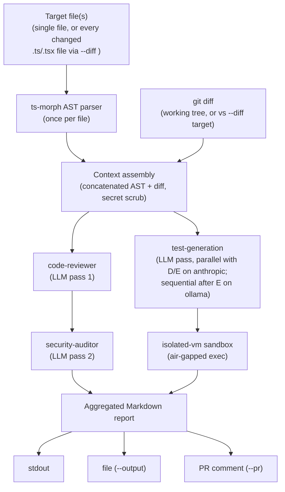

# Architecture

This document walks through what happens when you run `scrutineer review <file>` or `scrutineer review --diff <target>`, end to end.

## The shape of it: Planner, not a single call

Scrutineer doesn't ask one model "is this file okay?" and print the answer. It runs a small planner loop: extract context once, pass it through two specialized personas in sequence (each one sees the prior one's output), and verify a claim about the code's behavior by actually running generated code in a sandbox. On the `anthropic` provider, test generation runs concurrently with that persona chain, since it doesn't depend on either persona's findings; on `ollama` it runs sequentially after the chain instead, since a concurrent `generateText` call against the same local model was found to contend with the persona chain's calls and intermittently fail (see [issue #22](https://github.com/dallaskoncir/scrutineer/issues/22)). Once every branch finishes, it delivers the aggregated result wherever you asked for it.



## 1. Context extraction (`src/services/ast-parser.ts`, `git-diff.ts`, `secret-scrubber.ts`)

Before any model is involved, every target file is parsed with `ts-morph` to pull out:
- exported function signatures (name, parameters, return type, async-ness, JSDoc)
- imports (named/default/namespace, type-only or not)
- interfaces (properties, `extends`)

This gets rendered to Markdown optimized for an LLM context window — it's denser and more reliable than pasting the raw file, and it means the model gets the same structured facts about the file every run.

Alongside the AST summary, `git-diff.ts` pulls a diff, and `secret-scrubber.ts` redacts anything that looks like a credential out of it before it goes anywhere near a prompt. Which diff depends on how you invoked `review`:
- **`scrutineer review <file>`** — the file's working-tree or staged diff (falling back to the full file if there's no diff yet).
- **`scrutineer review --diff <target>`** — `getChangedFiles()` resolves `git diff --name-only <target>...HEAD`, filtered to `.ts`/`.tsx`, then `getDiffAgainstTarget()` diffs all of those files against `<target>` in one `git diff` call. Every changed file's AST summary and diff are concatenated (with per-file headers) into a single `astContext`/`diff` pair, and that combined context goes through the pipeline as **one** batch — one `runReviewPipeline` call covering every changed file, not one call per file — so findings can reference across files instead of reviewing each in isolation. `<target>` is validated to reject anything starting with `-` before it reaches `git`, since git parses the revision-range argument as a flag otherwise (a real argument-injection risk, not just a shell one — `execFileSync` already rules out shell injection on its own).

## 2. The personas (`src/services/prompt-loader.ts`)

The `code-reviewer` and `security-auditor` system prompts aren't written in this codebase — they're fetched from Addy Osmani's [`agent-skills`](https://github.com/addyosmani/agent-skills) repository, which packages reusable, well-tested agent personas as Markdown files with YAML frontmatter (`name`, `description`, then the prompt body).

The loader pins to a specific commit and verifies each fetched (or cached) file against a known SHA-256 hash before using it — so a compromised upstream file, a MITM'd fetch, or a tampered local cache entry gets rejected instead of silently trusted. Fetched content is cached to disk for 24 hours to avoid re-fetching on every run. See [ADR-003](decisions/0003-pin-and-hash-verify-persona-prompts.md) for why this is pin-and-hash rather than vendoring the files or trusting the upstream default branch.

## 3. The orchestration loop (`src/services/ai-orchestrator.ts`)

This is the "Planner": the two personas run as sequential passes, because the second pass is supposed to build on the first, but test generation runs as a separate branch since it only needs the AST context + diff, not either persona's output — whether that branch runs concurrently with the persona chain or after it depends on the provider:

1. **code-reviewer** sees the AST context + diff and produces general findings (correctness, readability, architecture, security, performance).
2. **security-auditor** sees the *same* AST context + diff, plus the code-reviewer's findings, and does a security-focused deep dive — building on what the first pass already flagged instead of duplicating it.
3. **test generation** — the same model is prompted with a different system prompt to write a small smoke test. Because the sandbox it's about to run in has no filesystem access, the model can't `import` the file under test — the prompt tells it to reimplement just the pure logic it needs inline, assert against it, and log `PASS` or `FAIL: <reason>`.

On the **anthropic** provider, test generation is kicked off right after the code-review call starts, in parallel with the code-reviewer/security-auditor chain — each call is an independent request to Anthropic's API, so there's no shared-resource contention. The CLI's progress messages reflect this: they fire in the order `code-review` → `sandbox-test` → `security-audit`, not the numbered order above.

On the **ollama** provider, test generation instead runs after `security-audit` completes. Ollama serves one local model process, and a concurrent `generateText` call against that same model while the persona chain is also mid-flight was found to intermittently return a bare 400 (`Bad Request`) — see [issue #22](https://github.com/dallaskoncir/scrutineer/issues/22). Progress messages fire in the numbered order above: `code-review` → `security-audit` → `sandbox-test`.

All three passes go through `src/utils/model-factory.ts`, which is what makes the provider swappable — `createModel("anthropic")` and `createModel("ollama")` both return the same `LanguageModel` type from the Vercel AI SDK, so the orchestration code above never branches on which provider is active. The orchestrator also accepts an optional progress callback, fired at each stage boundary, which is how the CLI drives its step-by-step terminal UI without the orchestration logic knowing anything about `@clack/prompts`. See [ADR-001](decisions/0001-provider-agnostic-model-factory.md) for why this is a thin factory over the Vercel AI SDK rather than LangChain or a hand-rolled per-provider client.

**Prompt caching (Anthropic only).** The AST-context/diff block is byte-identical across all three calls, so on the `anthropic` provider it's marked cacheable (`providerOptions.anthropic.cacheControl`), along with each persona's system prompt. The guaranteed intra-run win is the **security-audit** call: it only starts after `await`ing the code-review call, so it reliably reads the AST/diff block back from cache instead of resending it. The **test-generation** call is not guaranteed the same win — because it's kicked off concurrently with (not after) the code-review call, whichever of the two reaches Anthropic first pays the cache-write cost, and the other only gets a cache read if the write has already landed server-side by the time its request arrives. Both outcomes are visible in the per-call `cache read` / `cache write` token counts logged by `logUsage` (`ai-orchestrator.ts`) — check those rather than assuming the win when tuning this. This trades a data-retention change for the saving that does land: cached content is held server-side by Anthropic for the cache TTL (a few minutes, ephemeral) instead of being processed per-request and discarded, so the file's AST/diff — already redacted by `secret-scrubber.ts`, but still your source code — persists there briefly. `ollama` never sets `cacheControl`, so this doesn't apply when running fully air-gapped.

## 4. Sandboxed verification (`src/services/sandbox.ts`)

The generated test isn't just printed — it's actually executed, inside an ephemeral `isolated-vm` isolate:

- **Bounded memory** (32MB default) and **execution timeout** (5s default), both configurable per call.
- **No Node built-ins reachable from inside the isolate** — `require`, `process`, `fetch`, and the filesystem are all unavailable. The isolate starts empty; the only thing added back is a `console` shim (`log`/`info`/`warn`/`error`/`assert`) that forwards calls to arrays on the host side.
- **Nothing the sandboxed script does can crash the host process.** Syntax errors, thrown exceptions, failed assertions, timeouts, and memory-limit kills are all captured into the result (`{ ok, logs, errors }`) instead of propagating — this is enforced by `src/services/sandbox.test.ts`, which specifically regression-tests the memory-limit-kill path (a real bug caught here during review: a tripped memory limit disposes the isolate internally, and disposing it again crashes the host if you don't guard for it).

The result of this step is what turns "the model says the code has a bug" into "here's a test that ran and failed" — a much stronger signal, and the reason this is a sandbox and not just a fourth prompt. See [ADR-002](decisions/0002-isolated-vm-sandbox.md) for why `isolated-vm` and not `vm2`, Node's built-in `vm`, or a child process with OS-level limits.

## 5. Reporting and delivery (`src/services/report.ts`, `github-client.ts`)

Once all three passes and the sandbox run complete, `report.ts` aggregates them into a single Markdown document: file/provider/timestamp metadata, the code review, the security audit, and the sandbox result (with the generated code and its captured logs/errors). Code blocks use a fence chosen to be longer than any backtick run already inside the generated code, so an LLM-produced snippet containing its own ` ``` ` can't corrupt the rest of the report.

That report goes wherever you asked for it — any combination of:
- printed to the terminal (the default, if neither flag below is set)
- written to a file (`--output <path>`)
- posted as a GitHub PR comment via the REST API (`--pr <number>`), with the target repo inferred from your `origin` remote unless you override it with `--repo`

## Why provider-agnostic matters here specifically

The model factory isn't just a nice abstraction — it's what makes it possible to run the entire pipeline above (context extraction, both review passes, test generation, sandboxed execution) against a local Ollama model with zero network calls to a third-party API. That's the difference between "an AI code review tool" and one that can run inside an environment that can't send source code off-box at all.
