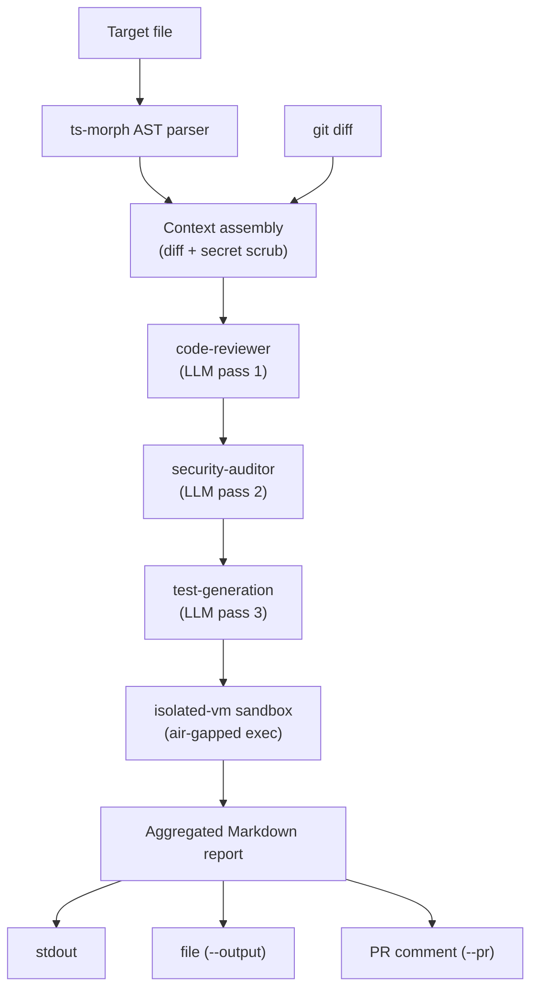

# Architecture

This document walks through what happens when you run `slipstream review <file>`, end to end.

## The shape of it: Planner, not a single call

Slipstream doesn't ask one model "is this file okay?" and print the answer. It runs a small planner loop: extract context once, pass it through two specialized personas in sequence (each one sees the prior one's output), verify a claim about the code's behavior by actually running generated code in a sandbox, and then deliver the aggregated result wherever you asked for it.



## 1. Context extraction (`src/services/ast-parser.ts`, `git-diff.ts`, `secret-scrubber.ts`)

Before any model is involved, the target file is parsed with `ts-morph` to pull out:
- exported function signatures (name, parameters, return type, async-ness, JSDoc)
- imports (named/default/namespace, type-only or not)
- interfaces (properties, `extends`)

This gets rendered to Markdown optimized for an LLM context window — it's denser and more reliable than pasting the raw file, and it means the model gets the same structured facts about the file every run.

Alongside the AST summary, `git-diff.ts` pulls the file's working-tree or staged diff (falling back to the full file if there's no diff yet), and `secret-scrubber.ts` redacts anything that looks like a credential out of it before it goes anywhere near a prompt.

## 2. The personas (`src/services/prompt-loader.ts`)

The `code-reviewer` and `security-auditor` system prompts aren't written in this codebase — they're fetched from Addy Osmani's [`agent-skills`](https://github.com/addyosmani/agent-skills) repository, which packages reusable, well-tested agent personas as Markdown files with YAML frontmatter (`name`, `description`, then the prompt body).

The loader pins to a specific commit and verifies each fetched (or cached) file against a known SHA-256 hash before using it — so a compromised upstream file, a MITM'd fetch, or a tampered local cache entry gets rejected instead of silently trusted. Fetched content is cached to disk for 24 hours to avoid re-fetching on every run.

## 3. The orchestration loop (`src/services/ai-orchestrator.ts`)

This is the "Planner": it runs the two personas as sequential passes, not in parallel, because the second pass is supposed to build on the first:

1. **code-reviewer** sees the AST context + diff and produces general findings (correctness, readability, architecture, security, performance).
2. **security-auditor** sees the *same* AST context + diff, plus the code-reviewer's findings, and does a security-focused deep dive — building on what the first pass already flagged instead of duplicating it.
3. **test generation** — the same model is prompted a third time, with a different system prompt, to write a small smoke test. Because the sandbox it's about to run in has no filesystem access, the model can't `import` the file under test — the prompt tells it to reimplement just the pure logic it needs inline, assert against it, and log `PASS` or `FAIL: <reason>`.

All three passes go through `src/utils/model-factory.ts`, which is what makes the provider swappable — `createModel("anthropic")` and `createModel("ollama")` both return the same `LanguageModel` type from the Vercel AI SDK, so the orchestration code above never branches on which provider is active. The orchestrator also accepts an optional progress callback, fired at each stage boundary, which is how the CLI drives its step-by-step terminal UI without the orchestration logic knowing anything about `@clack/prompts`.

## 4. Sandboxed verification (`src/services/sandbox.ts`)

The generated test isn't just printed — it's actually executed, inside an ephemeral `isolated-vm` isolate:

- **Bounded memory** (32MB default) and **execution timeout** (5s default), both configurable per call.
- **No Node built-ins reachable from inside the isolate** — `require`, `process`, `fetch`, and the filesystem are all unavailable. The isolate starts empty; the only thing added back is a `console` shim (`log`/`info`/`warn`/`error`/`assert`) that forwards calls to arrays on the host side.
- **Nothing the sandboxed script does can crash the host process.** Syntax errors, thrown exceptions, failed assertions, timeouts, and memory-limit kills are all captured into the result (`{ ok, logs, errors }`) instead of propagating — this is enforced by `src/services/sandbox.test.ts`, which specifically regression-tests the memory-limit-kill path (a real bug caught here during review: a tripped memory limit disposes the isolate internally, and disposing it again crashes the host if you don't guard for it).

The result of this step is what turns "the model says the code has a bug" into "here's a test that ran and failed" — a much stronger signal, and the reason this is a sandbox and not just a fourth prompt.

## 5. Reporting and delivery (`src/services/report.ts`, `github-client.ts`)

Once all three passes and the sandbox run complete, `report.ts` aggregates them into a single Markdown document: file/provider/timestamp metadata, the code review, the security audit, and the sandbox result (with the generated code and its captured logs/errors). Code blocks use a fence chosen to be longer than any backtick run already inside the generated code, so an LLM-produced snippet containing its own ` ``` ` can't corrupt the rest of the report.

That report goes wherever you asked for it — any combination of:
- printed to the terminal (the default, if neither flag below is set)
- written to a file (`--output <path>`)
- posted as a GitHub PR comment via the REST API (`--pr <number>`), with the target repo inferred from your `origin` remote unless you override it with `--repo`

## Why provider-agnostic matters here specifically

The model factory isn't just a nice abstraction — it's what makes it possible to run the entire pipeline above (context extraction, both review passes, test generation, sandboxed execution) against a local Ollama model with zero network calls to a third-party API. That's the difference between "an AI code review tool" and one that can run inside an environment that can't send source code off-box at all.
